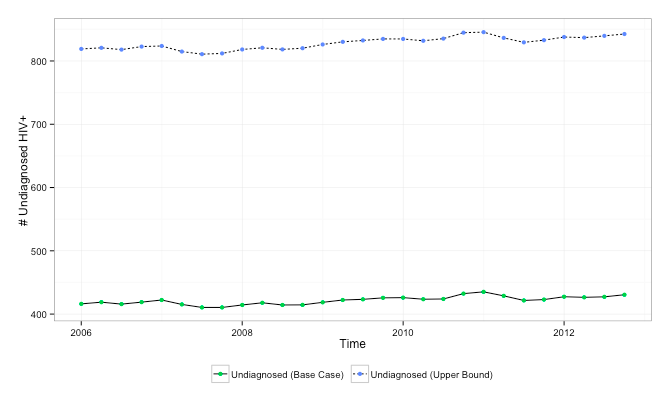
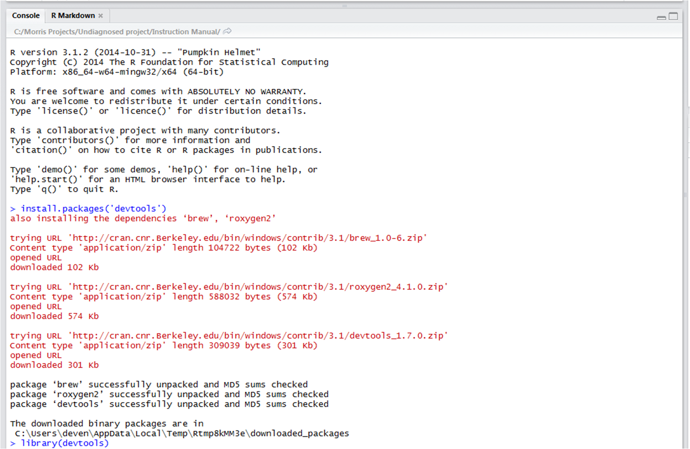
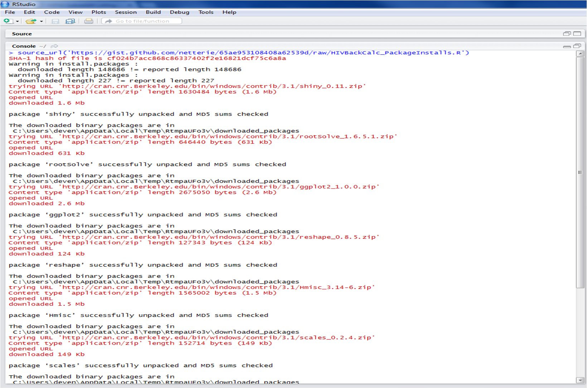

# Introduction

HIVBackCalc is a tool for the estimation of HIV incidence and undiagnosed cases. The method combines data on the number of diagnoses per quarter with information on the distribution of the time between HIV infection and diagnosis, or TID. These two elements are used to backcalculate the number of incident cases per quarter that must have occurred in order to produce the observed diagnoses. The number of undiagnosed cases per quarter are those cases estimated to have already been infected but not yet diagnosed in the quarter. Because TID is not directly observed, the method uses the time between last negative HIV test and diagnosis to approximate TID. This inter-test interval or infection period window is obtained from testing history data.

HIVBackCalc performs its estimation in R, a free software environment for statistical computing and graphics. The HIVBackCalc app is a browser-based user-friendly interface to R. The app can be run online or locally on a user's machine using a platform called RShiny. 

Even for users who ultimately wish to run the app locally, we recommend starting with the online version and the embedded sample dataset. This manual thus begins with [system](#system-requirements) and [data](#data-requirements) requirements and then moves into a [guided analysis using a sample dataset with the online system](#running-the-app-online). Subsequent sections provide instructions for local installation: first [in detail for those new to R](#running-the-app-locally) and then as a [quick guide for those familiar with R](#running-the-app-locally-quick-guide). 

[Back to Table of Contents](#TOC)

# System requirements

## Web browser
Google Chrome is recomended. There are know issues with older versions of Internet Explorer, and other browsers have not been tested.

## R Software
R software is necessary only for running the app locally. Download instructions are provided in the [local installation guide](#running-the-app-locally).

[Back to Table of Contents](#TOC)

# Data requirements

This tool is designed to work with testing history data from the Enhanced HIV/AIDS Reporting System (eHARS) person files.  The following SAS program can be used to extract the required variables from eHARS person files.

([SAS Extraction code](https://raw.githubusercontent.com/netterie/HIVBackCalc_App/master/development/Common Read In CBA.sas))

Right-click on any white space and use _save as_ to download the script to your computer.

*Note:* the SAS script requires that the eHARS data are in the "person" data file structure.     

The tables below list the required eHARS variables.

## eHARS "person view" variables   
If using data other than eHARS these are the variable that will need to be provided by the user.

eHARS name  | Description | Type
------------- | ------------- | -------------
hiv_aids_age_yrs | age at diagnosis in years |
race | race  | categorical
trans_categ | mode of HIV transmission | categorical
hiv_dx_dt | date of first pos HIV test (lab confirmed) |
aids_dx_dt | date of first AIDS classifying condition |
screen_last_neg_dt | date of last neg HIV test (lab confirmed) |
cd4_first_hiv_dt | date of earliest CD4 |
cd4_first_hiv_type | type of CD4 test | count or percent
cd4_first_hiv_value | result of CD4 test |
vl_first_det_dt | date of earliest detectable viral load |
vl_first_det_value | value of detectable viral load |
rsh_state_cd | state of residence at HIV diagnosis |
tth_ever_neg | TTH: Y/N ever had a neg HIV test |
tth_last_neg_dt | TTH: date of last neg HIV test |
tth_first_pos_dt | TTH: date of first pos HIV test |

## New variable names and format

Once the required variables are extracted from eHARS, the user will need to construct a few key variables used by the HIVBackCalc tool. Future versions of the app will be able to automatically reformat eHARS data to construct the required variables. The table below outlines the variables required by HIVBackCalc.

Variable name  | Description | Type | Values
------------- | ------------- | ------------- | -------------
mode | mode of transmission groups | character | TBD
hdx_age | age at diagnosis | numeric |
yearDx | year of diagnosis | numeric | 
everHadNegTest | ever had a negative HIV test | character | TRUE FALSE or NA
race | race | character | white, Black, Other
agecat5 | describes 5-year age groups | character
timeDx | quarter-year of diagnosis | numeric | 1 to 4
infPeriod | time from last negative test to diagnosis in years | numeric | 

[Back to Table of Contents](#TOC)

# Running the app online

The online app is available at the link below. Open the app in a new tab and follow the steps below to do an example analysis, either using the included sample dataset or your own data.

([hivbackcalc](https://hivbackcalc.shinyapps.io/HIVBackCalc_App/))

## Overview of the app

The six tabs displayed at the top, from _Load Data_ to _About_, allow you to navigate through the major elements of the analysis and access supporting documentation.  

<center>

</center>

By default, the app displays the source code in a thin right-side panel. You may click _show below_ at the top of this panel if you would like to move the code below the app and free up some screen width.

## Loading data into the app

__Warning: data uploaded to the online version of HIVBackCalc are not secure__

### Selecting the data file

The app opens with the _Load Data_ tab. 

1. The gray left panel allows you to use the sample dataset, "MSM in King County, WA," or upload your own data by clicking on the drop-down menu and selecting "Upload data." You will then see a prompt to choose a comma-separated values (CSV) file from your hard drive. CSV files have the .csv extension and can be created by Excel. By default, the sample dataset is selected. These data are simulated to approximate testing histories observed in MSM in King County, WA. 

2. The right panel with the sub-tab labeled "Confirm Data" displays the first 10 rows of the selected dataset.

<center>

</center>

### Specifying subgroups

If you wish to analyze a sub-sample of the data rather than all the records in the dataset, click on the "Optional: Subgroups" sub-tab. You can then select a variable by which to subset the data and below, select the subgroup. For this guided analysis, however, we will analyze the full sample.

<center>

</center>

## Looking at your data with the HIVBackCalc App

Now, click on the _Examine Data_ tab at the top of the app.  

1. This tab opens with an "Overview" sub-tab, which describes the dataset by demographic groups and shows the testing history responses within each group. In the sample data, there are 287 men in the 21-25 year old category, which represents 19% of the total sample. 76% of these men have testing history data, 10% do not having testing history data, and for 14% the testing history data is missing.

<center>
   
</center>

  2.  By clicking the "Diagnosis" sub-tab you can see the number of newly diagnoses cases during each quarter year.  In this example you can see that there are fluctuation quarter to quarter but there is no obvious trend from 2006 to 2013. 

<center>

</center>

  4.  By clicking the _Testing Histories_ tab you can see the percentage of respondents that report having had a prior test at each time interval which is between 70% and 80% in these data.  The cases for whom there are no prior test data are further divided into those that are known to have not had a prior test and those for whom prior test data are not known.  

<center>

</center>

## Calculate the TID

After the data have been reviewed, the analysis begins with the _Calculate TID_ tab at the top of the page.  Recall that TID refers to the time from infection to diagnosis, the time that an individual spends in the undiagnosed state. HIVBackCalc estimates this time from the testing history data using two different assumptions:

1. Base Case - Missing testing history data are considered missing at random and are excluded from calculating the TID. The probability of infection is uniformly distributed between the time of last negative test and time of diagnosis.

2. Upper Bound - Missing testing history data are considered missing at random and are excluded from calculating the TID. Infection is assumed to occur immediately following the date of last negative test, a worst case assumption.

*Note:* HIVBackCalc is currently in the beta testing phase.  The calculation of TID is currently limited to the assumptions above.  We are currently working to implement additional assumptions for the calculation of TID including risk based testing and a uniform distibution for date of infection for those with missing or no reported prior test date.

The TID under these two assumptions are displayed on the same plot. The y-axis represents the fraction of the population undiagnosed and the x-axis is time in years. In this example only about 50% of cases are undiagnosed after 1 year in the base case, but in the upper bound scenario over 75% of cases remain undiagnosed after 1 year.  At 18 years the undiagnosed fraction drops to zero in all cases.  This is due to an assumption in the model that infection can not remain undiagnosed for longer that 18 years. 

<center>
  
</center>

  
## Running the backcalculation

Click on the _Backcalculate Infections_ tab at the top of the app to get to the backcalculation section.  Clicking on the _Run backcalculation_ button on the left will run the backcalculation.  This may take a few moments, as indicated by the progress message in the top right corner.

Plots and a table appear after the backcalculation is complete. Each describes quarterly diagnosis counts along with estimated quarterly incidence counts and undiagnosed counts.  While the plots show these statistics for each quarter within the data's time period, the table summarizes them over all quarters.  

Each assumption for the TID, Base Case and Upper Bound, generates separate incidence and undiagnosed estiamtes.  In this example, the different assumptions had little impact on the estimated incidence but a substantial impact on the estimates of the number of undiagnosed cases. This is because undiagnosed cases in 2006-2012 arise from incident cases from up to 18 years prior. The Base Case and Upper Bound make assumptions about how the incident cases are distributed over that entire time period, while the plot only depicts 2006-2012 incidence.   

<center>

 
 

 

</center>

[Back to Table of Contents](#TOC)

# Running the app locally

To ensure data privacy, you may choose to load the app locally rather than use the online version. Running the app locally requires installing R and some related extensions. Users already familiar with R may skip forward to the [quick guide for local installation](#running-the-app-locally-quick-guide).  

## Downloading R

The app has a minimum R requirement of R version 3.1.2.   
To download the R software package click on the link below and then select the appropriate OS. 

([R](http://cran.rstudio.com))

After installing R you will need to install Rstudio which is a GUI user interface for R.  The Rstudio interface will make running the app easier and assist with the diagnosis of any problems.  Download and install Rstudio by clicking the link below. 

([Rstudio](http://www.rstudio.com/products/rstudio/download))
    
## Downloading R packages

After installing Rstudio several R packages will also need to be downloaded and installed.  To download and install the _devtools_ package:  

1. Open RStudio
2. Type or copy the following lines into the R console window, hitting return after each line:

```r
install.packages('devtools')
library(devtools)
```

When installing _devtools_ R will automatically install any additional packages that are required by the _devtools_
package.  R will provide output indicating which additional packages are being installed.  See the example below:

<center>

</center>


*Note:* If you are running either Windows 7 or Windows 8 you may get a notification that you can not write to the 'R\libraries' folder.  This may occur as a result of the default "read only" setting applied to this folder.  You can either change the folder setting or select an alternate folder to store your R packages. Also, disregard any warnings in the console regaurding the installation of _rtools_.    
     
The HIVBackCalc app uses a web application tool called RShiny that provides a GUI interface for R code. The RShiny R package and its dependencies are required to run the app.  To download the this software type or copy and paste the command below in to the Rstudio console.  This command will install RShiny and its dependencies. As this command is executed R will provide information about all of the dependencies that are also being installed.  See the example:

```r
source_url('https://gist.github.com/netterie/65ae953108408a62539d/raw/HIVBackCalc_PackageInstalls.R')
```

<center>

</center>

Start RShiny with R by typing the following into the R console window and hitting return:

```r
library(shiny)  
```

## Downloading the HIVBackCalc app

Once shiny is running in the R session HIVBackCalc can be run by typing the code below in to the R console window (or cut and paste) and pressing enter:

```r
runGitHub('netterie/HIVBackCalc_App', launch.browser=TRUE)  
``` 

If an error appears after the above step, e.g. "cannot open URL", use these alternate instructions.

1. In a browser, navigate to https://github.com/netterie/HIVBackCalc_App  
2. Click the "Download ZIP" button in the bottom right corner  
3. Rename the file "HIVBackCalc_App.zip" (remove the -master part) and save to a simple location, e.g. C:  
4. Unzip the .zip file in that location  
5. In R, type the following, hitting "enter" after each line. The syntax below assumes that the folder has been unzipped to C:\, so the folder C:\HIVBackCalc_App is on the machine. If a different location is selected for the HIVBackCalc app, replace C:\ with the appropriate location, using only forward slashes instead of backslashes, as shown below.  

```r
setwd('C:/HIVBackCalc_App')
library(shiny)
runApp(, launch.browser=TRUE)
```

## Using the app
The app is now live on your local machine rather than through the online host, but is otherwise identical. See [Overview of the app](#overview-of-the-app) and subsequent sections for a guide to using the app.

## Ending your session

To close the interface, return to R/RStudio and hit the Esc button. 

[Back to Table of Contents](#TOC)

# Running the app locally quick guide

## Downloading R packages and the HIVBackCalc app
If the user is familiar with R, execute the following lines of code to launch the app locally. The code below uses the _devtools_ package to install dependencies and access the app code stored on GitHub. 

If an error appears, e.g. "cannot open URL", try the alternate instructions given [here](#downloading-the-hivbackcalc-app).

```r
install.packages('devtools')
library(devtools)
source_url('https://gist.github.com/netterie/65ae953108408a62539d/raw/HIVBackCalc_PackageInstalls.R')
library(shiny) 
runGitHub('netterie/HIVBackCalc_App', launch.browser=TRUE)
```

## Using the app
The app is now live on your local machine rather than through the online host, but is otherwise identical. See [Overview of the app](#overview-of-the-app) and subsequent sections for a guide to using the app.

## Ending your session

To close the interface, return to R/RStudio and hit the Esc button. 

[Back to Table of Contents](#TOC)

