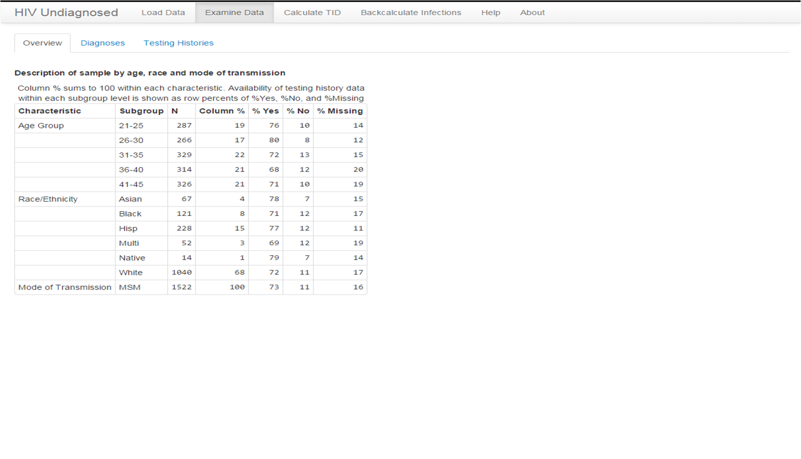
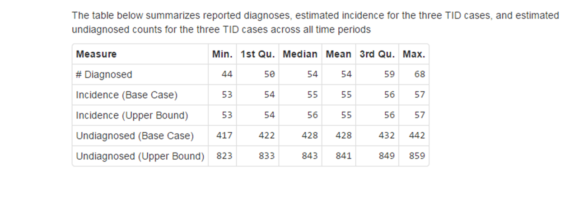

# Contents

### 1 Introduction
### 2 Data Requirements
### 3 Running HIVBackCalc on an internal system (a step by step example)
####      3.1 Downloading R
####      3.2 Downloading R packages
####      3.3 Downloading the HIVBackCalc App
####      3.4 Downloading the example data
####      3.5 Uploading data to the HIVBackCalc App
####      3.6 Looking at your data with the HIVBackCalc App
####      3.7 Calculating the TID.
####      3.8 Running the back Calculation
### 4 Running HIVBackCalc on an internal system (quick instruction guide)
####      4.1 Uploading data
####      4.2 Looking at your data with the HIVBackCalc App
####      4.3 Running the back Calculation
####      4.4 Ending your session
### 5 Running HIVBackCalc on the web

##Introduction

HIVBackCalc is a tool for the estimation of HIV incidence and undiagnosed cases. The method combines data on the number of diagnoses per quarter with information on the distribution of
the time between HIV infection and diagnosis, or TID. These two elements are used to back-calculate the number of incident cases per quarter that must have occurred in order to produce the observed number of diagnoses. The number of undiagnosed cases per quarter are those cases who are estimated to have already been infected but not yet diagnosed in a given quarter. Because TID is not directly observed, the method uses the time between last negative HIV test and diagnosis to approximate TID. 

## Data Requirments

This tool is designed to work with data from the Enhanced HIV/AIDS Reporting System (eHARS).  The following SAS program can be used to extract the required data from eHARS.

* hyperlink to SAS file.

Once the required variables are extracted from eHARS the HIVBackCalc tool can automatically reformat the eHARS data and construct the variables used in the back-calculation that are not directly reported in eHARS.  The tables below provide a list of the eHARS data that is extracted for use by HIVBackCalc, a list of new variable names and the variable structures that are assigned to the eHARS data for use by HIVBackCalc, and a list of the variables that are constructed for HIVBackCalc.

####eHARS variables   
If using data other than eHARS these are the variable that will need to be provided by the user.

eHARS name  | Description | format
------------- | ------------- | -------------
hiv_aids_age_yrs | age at diagnosis in years |
race | race  | categorical
trans_categ | mode of HIV transmission | categorical
hiv_dx_dt | date of first pos HIV test (lab confirmed) |
aids_dx_dt | date of first AIDS classifying condition |
screen_last_neg_dt | date of last neg HIV test (lab confirmed) |
cd4_first_hiv_dt | date of earliest CD4 |
cd4_first_hiv_type | type of CD4 test | count or percent
cd4_first_hiv_value | result of CD4 test |
vl_first_det_dt | date of earliest detectable viral load |
vl_first_det_value | value of detectable viral load |
rsh_state_cd | state of residence at HIV diagnosis |
tth_ever_neg | TTH: Y/N ever had a neg HIV test |
tth_last_neg_dt | TTH: date of last neg HIV test |
tth_first_pos_dt | TTH: date of first pos HIV test |

####New Variable names and formating
The HIVBackCalc will automatically rename and transform the eHARS data in to the following Variables.

Variable name  | Description | format | Values
------------- | ------------- | ------------- | -------------
mode | mode of transmission groups | character | TBD
hdx_age | age at diagnosis | character |
yearDx | year of diagnosis | numeric | 
everHadNegTest | ever had a negative HIV test | character | TRUE FALSE or NA

    

####Construted Varibles
These new variables will automatically be constructed from the eHARS data for use in the back calculation and reporting.  

Variable name  | Description | format | Values
------------- | ------------- | ------------- | -------------
race | race | character | white, Black, Other
agecat5 | describes 5-year age groups | character
timeDx | quarter-year of diagnosis | numeric | 1 to 4
infPeriod | time from last negative test to diagnosis in years | numeric | 

## 3 Running HIVBackCalc on an internal system

This section provides a step by step example to illustrate the use and functionality of HIVBackCalc beginning with installing the necessary software and working all the way through importing and analyzing data.  Users already familiar with R may skip forward to section 4 of this guide which provides an abbreviated reference guide for using HIVBackCalc.  HIVBackCalc is an open source application available for download and use on internal systems.  While HIVBackCalc is designed to be an easy to use application with an intuitive GUI interface it depends upon R software, a free software environment for statistical computing and graphics, and several R packages including _devtools_ and _Shiny_.  In order to run HIVBackCalc you must have the R software and supporting R packages downloaded on your local machine. The HIVBackCalc App also uses the web browser to provide an easy to use front end.  Before trying to run HIVBackCalc please make sure your browser is up to data.

#### 3.1 Downloading R

HIVBackCalc has a minimum R requirement of R version 3.1.2.   
To download the R software package click on the link below and then select the appropriate OS. 

([R](http://cran.rstudio.com))

After installing R you will need to install Rstudio which is a GUI user interface for R.  The Rstudio interface will make running HIVBackCalc easier and assist with the diagnosis of any problems.  Download and install Rstudio by clicking the link below. 

([Rstudio](http://www.rstudio.com/products/rstudio/download))
    
#### 3.2 Downloading R packages

After installing Rstudio several R packages will also need to be downloaded and installed.  To download and install the _devtools_ package:

      1. Open RStudio
      2. Type or copy the following lines into the R console window, hitting return after each line:

     install.packages('devtools')
     library(devtools)

When installing _devtools_ R will automatically install any additional packages that are required by the _devtools_
package.  R will provide output indicating which additional packages are being installed.  See the example below:

note: If you are running either Windows 7 or windows 8 you may get a notification that you can not write to the 'R\libraries' folder.  This may occur as a result of the default "read only" setting applied to this folder.  You can either change the folder setting or select an alternate folder to store your R packages.     
     

The HIVBackCalc app also uses a web application tool called Shiny that provides a GUI interface for R based applications. The Shiny package and its dependencies are required to run HIVBackCalc.  To download the this software type or copy and paste the command below in to the Rstudio console.  This command will install Shiny and its dependencies. As this command is executed R will provide information about all of the dependencies that are also being installed.  See the example:

source_url('https://gist.github.com/netterie/65ae953108408a62539d/raw/HIVBackCalc_PackageInstalls.R')

Start Shiny with R by typing the following into the R console window and hitting return.

     library(shiny)

     
#### 3.3 Downloading the HIVBackCalc App

Once shiny is running in the R session HIVBackCalc can be run by typing (or copy and paste) in to the R console window:

     runGitHub('netterie/HIVBackCalc_App', launch.browser=TRUE)
     

If an error appears after the above step, e.g. "cannot open URL", use these alternate instructions:

        A. In a browser, navigate to https://github.com/netterie/HIVBackCalc_App
        B. Click the "Download ZIP" button in the bottom right corner
        C. Rename the file "HIVBackCalc_App.zip" (remove the -master part) and save to a simple location, e.g. C:
        D. Unzip the .zip file in that location
        E. In R, type the following, hitting "enter" after each line. The syntax below assumes that the folder has been unzipped to C:\, so the folder C:\HIVBackCalc_App is on the machine. If a different location is selected for the HIVBackCalc app, replace C:\ with the appropriate location, using only forward slashes instead of backslashes, as shown below.

        setwd('C:/HIVBackCalc_App')
        library(shiny)
        runApp(, launch.browser=TRUE)
        

####    3.4 Download the example data.

In this example we will use a simulated data set that resembles data from King County Washington. The example data set can be downloaded using the link below.

([example data](https://github.com/netterie/HIVBackCalc_App/tree/master/development))

right-click "data_KC_sim.csv" to download the data to your computer.
    
####    3.5 Uploading data to the HIVBackCalc App.

  1. From the _load data_ tab on the HIVBackCalc app specify that the data has headers, is comma delineated and uses           double quotes.

  3.  Click on the 'choose file' button on the left panel and select the data "data_KC_sim".

    -the first 10 rows on the data will be displayed.
    

####    3.6 Looking at your data with the HIVBackCalc App

  1. Click on the _Examine Data_ tab at the top of the app.  

  2. From the "Examine Data" tab you can look at an overview of your data which includes the distribution of observations across demographic groups as well as the percentage of data within demographic group with the testing history data needed for the back calculation.
  
In this example you should see that there are 287 men in the 21-25 year old category, which represents 19% of the total sample, 76% of them have testing history data, 10% do not having testing history data, and for 14% the testing history data is missing.

   

  3.  By clicking the "Diagnosis" tab you can see the number of newly diagnoses cases during each quarter year.  In this example you can see that there are fluctuation quarter to quarter but there is no obvious trend from 2006 to 2013. 

 ** -Some kind of caveat about assumtions if trends are observed**.

  4.  By clicking the _Testing Histories_ tab you can see the percentage of respondents that report having had a prior test at each time interval which is between 70% and 80% in these data.  The cases for whom there are no prior test data are further divided into those that are known to have not had a prior test and those for whom prior test data are not known.  

####    3.7 Calculate the TID.

By clicking the _Calculate TID_ tab you can see the undiagnosed fraction by duration of infection.  Because TID is calculated using three different sets of assumptions the plot includes all three alternatives.  In this example only about 50% of cases are undiagnosed after 1 year, but in the worst case scenarios 75% of cases remain undiagnosed after 1 year.  You will also note that at 18 years the undiagnosed fraction drops top zero in all cases.  This is due to an assumption in the model that infection can not remain undiagnosed for longer that 18 years. 

  
  
  ** -Some kind of caveat about assumtions if trends are observed or if the percentage of prior tests is low either due to low testing rates or high missingness**.
  
####    3.8 Running the back Calculation

Click on the _Backcalculate infections_ tab at the top of the app to get to the Back calculation section.  Clicking on the _run backcalculation_ button on the right will run the back-calculation.  This may take a few moments. 

The plot and the table provide the same information in different forms including the number of diagnosed cases during each quarter, the predicted incidence and the estimated number of undiagnosed cases.  The incidence and the number of undiagnosed cases are generate under the three different set of assumptions for calculating the TID.  As you can see in the plot below, in this example the different assumptions had little impact on the estimated incidence but a substantial impact on the estimates of the number of undiagnosed cases.     

 

 

#### 4.1 Uploading data

After HIVBackCalc has opened in the web browser, the panel on the left can be used to choose a data file. 

  1. Click on the _choose file_ button on the left panel to select a data file.
    - note the data requirements in the previous section.
    - The structure of the data file can be specified by indicating if there is a header, the type of separator and the quote usage.
    
  2. The first 10 rows on the data will automatically be displayed.  Review the data to make sure that they displayed data does not contain unexpected values or errors.
   

#### 4.2 Looking at your data with the HIVBackCalc App

##### Examine Data.
Once the data are loaded a data summary is created and can be viewed by selected the _Examine Data_ tab at the top of the app.  Under the _Examine Data_ tab there are three sub-tabs.

  1. _Overview_ - provides the number of observations in each demographic group as well as the fraction of the total sample in each demographic group.  The overview also includes the percentage of each subgroup that has testing history data which will be used to calculate the time between infection and diagnosis (TID)  which is the basis of the back-calculation.
  
  2. _Diagnosis_ - Graphical representation of the number of cases diagnosed during each quarter year of the sample time frame.  
  
  3. _Testing Histories_ - This graph provides the percentage of the sample during each water that had a prior negative test, did not have a prior negative test, or had missing testing history data.  
  
      -note:  The higher the proportion of cases that either do not have a prior negative test or have missing data the greater the potential impact of some modeling assumptions on the TID calculation and the back-calculation.  These assumptions and their impact on model predictions are discussed further here **(URL link to a working paper)**

##### Calculate TID.
After the data have been reviewed the analysis can be executed by selecting the _calculate TID_ tab at the top of the page.  The TID are automatically calculated and displayed using three different assumptions.  The TID are the basis for the back calculation.

1. Base Case - Missing testing history data are considered missing at random and are excluded from calculating the TID. The probability of infection is uniformly distributed between the time of last negative test and time of diagnosis.

2. Worst Case (Observed) - Missing testing history data are considered missing at random and are excluded from calculating the TID. Infection is assumed to occur immediately following the date of last negative test, a worst case assumption.

3. Worst Case (Missing data) - Missing testing history data are imputed using the assumption that infection occurred either 18 years prior to diagnosis or at age 16, whichever is more recent. For cases with testing history, infection is assumed to occur immediately following the date of last negative test.

#### 4.3 Running the back Calculation

Select the _Backcalculate infections_ tab at the top of the screen.  Click on the _run Infections_ button on the left.  This may take a few minutes to complete.

Once the calculations are complete the HIVBackCalc app will produce a plot and a table.  The top half of the plot provides counts of the number of newly diagnosed cases in each quarter as well as the predicted incidence under each of the assumptions TID calculation assumptions mentioned in the previous step.  The lower half of the plot provides counts of undiagnosed cases at each quarter under each of the three TID calculation assumptions.  The table provides the same information in tabular form. 

#### 4.4 Ending your session.

To close the interface, return to R/RStudio and hit the Esc button. 

## 5.0 Running HIVBackCalc online.

The HIVBackCalc tool can also be run online using the online Shiny App.To run HIVBackCalc online click on the link below and follow the instructions for running the application or your own computer starting at step 3.4.

([hivbackcalc](https://hivbackcalc.shinyapps.io/HIVBackCalc_App/))

    -Warning: data uploaded to the online version of HIVBackCalc are not secure!!!.
    

